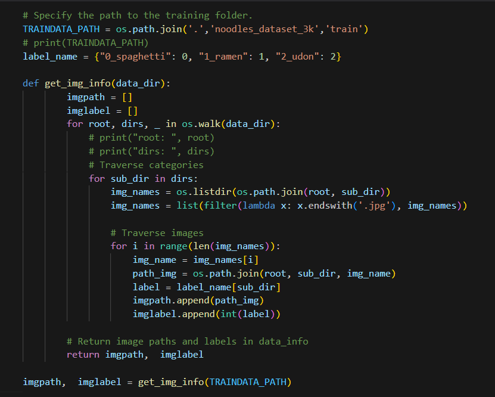
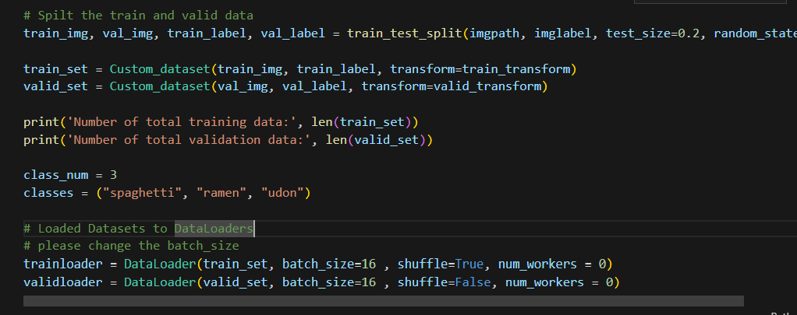
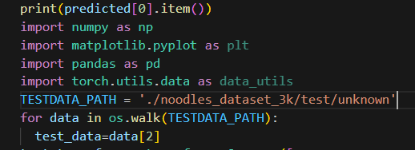
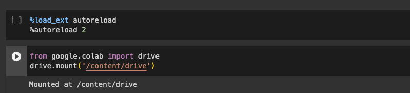
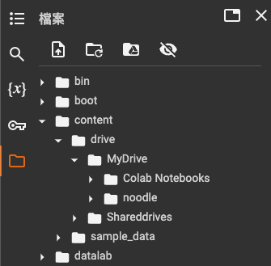

# Readme
## 模板使用說明
機器學習速成教學，先學會怎麼操作模板  
模板是什麼?  
其實跟字面上的意思很像，就是把機器學習要做的工作透過分段流程化後寫在.ipynb檔裡面  
流程可簡單分為:
1. 資料取得: 這個部分就是用程式把你要讀取的資料的路徑或下載網址寫出來
2. 資料前處理: 將照片之類的轉換成你訓練的輸入型式，並將訓練資料分成訓練和驗證兩種
3. 建立模型: 類似用手刻模型，基本上就是把你模型的樣子用程式描述
4. 訓練: 就是訓練，當中會紀錄過程中準確率的變化以及將訓練出來的模型存檔
5. 驗證: 剛剛的訓練資料中會有一小部分被當作驗證資料，模型套用後得到的結果可以當作訓練情況的參考
6. 使用模型: 使用模型有分為兩個情況，以我目前遇到的兩種為例：
* Mnist/Cifar：這些資料是 Pytorch 官方的範例資料，藉由網路直接下載，所以包含測資和答案都會在下載時一併取得，這種時候你在做驗證時會直接比對你用模型得到的答案以及它真正的它案，然後直接用變數去記錄你的正確率，最後 output 出你的正確率
* RGB 圖片：這個通常是你自行準備的訓練資料和測資，使用模型的形式會是你指定一個有未標記資料的資料夾，然後用變數去記錄你每個用模型得到的資料標記，最後再寫進 csv 裡面

## Dataset(資料集)
以 VGG_RGB 專案為例，訓練資料放在 Data/noodles 裡面  
裡面有兩個資料夾，分別是train 和 test  
我將快速帶過怎麼透過修改資料路徑來將程式套用在你想要的資料上
## train data(訓練資料)

### Label(標記)
  
在train資料夾裡面，有三個資料夾分別是0_spaghetti, 1_ramen, 2_udon

然後再看看上面的程式碼，那裡就是改成whatever你的已標記資料的資料夾名稱

  
往下一點點看到這段，你要做的就是按照順序把 classes 改成你標記的名稱  
例如: 如果你的資料是在分辨貓狗，那程式就會長這樣:
```python
class_num = 2
classes = ("cat", "dog")
```
填入你資料的類別數和名稱，切記要按照順序

## test data(測資)


這是倒數第二格的內容
反正就是要你把 TESTDATA_PATH 裡的資料路徑改成你測資的路徑  
喔然後在檔案路徑裡面，" . " 代表你的程式所在的資料夾，以此推測他和測資的相對路徑寫上去就好了  

## 用 Colab Notebooks 的人看這邊
Google Drive 的檔案路徑設定比較特別，這邊主要是釐清你的路徑要怎麼設才正確  
  
首先是這兩段程式碼  
第一個是用於 Jupyter 的指令，好像是用來載入套件的  
第二個是將你的檔案連結到你的 Google Drive，會需要你手動登入來賦予讀寫權限  

  
再來就是檔案路徑的部份  
我試過了，在 Colab 裡面沒辦法用相對路徑就讀取你想要讀取的資料路徑，所以一定要用絕對路徑  
至於絕對路徑要怎麼找，就是左邊欄位最下面有一個資料夾的 icon  
點開來就可以看到後台主機的檔案層級結構了，你要做的就是找到你要讀取的資料夾  
按旁邊的點點，選複製路徑，就可以貼到你的程式裡面了  
通常你的雲端硬碟會在 `/content/drive/MyDrive`，以防你迷路，在這裡告訴你


## 資料集種類差異：
Mnist：
* 大小：28x28
* channel：1  

RGB 圖片：
* 大小：224x224
* channel：3

根據以上資訊，需要注意你的模型中處理過程中每一層所輸出的資料大小會受輸入大小影響  
所以每一層之間的對接需要確保上一層的輸出大小要和下一層的輸入大小相同，不然模型會無法使用

## 結語
這些是趕工趕出來的，將就著看，有空在更新完整一點  
目前已完成模板說明，將來將更新  
- [x] 用 Mnist 和 RGB 資料之間的不同
- [ ] 使用 VGG 和 MLP 模型之間的不同  

並且將來會加入完整範例，除了 VGG16 搭配 RGB 資料外還會加入
- [x] MLP 搭配 Mnist
- [x] VGG16 搭配 Mnist

`1/6/2024`  
`1/8/2024` 更  
`1/9/2024` 二更 加入範例程式碼  